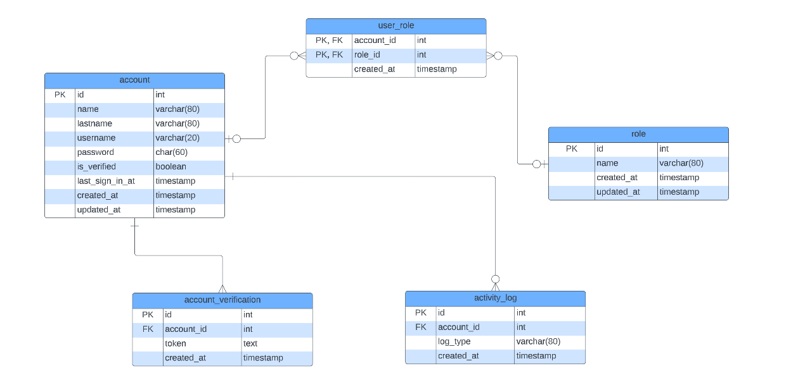

# Account Spaces

This is a simple module that manages account for a certain system. I say certain
system because it could be any system. The idea is that you can sign in or create an account,
look at your profile, edit it and see your activities log. For example, changing any of your profile counts
as an activity.


## Architecture & Diagrams 

### Entity Relationship Diagram



### Component Diagram
The following component diagram shows the overall structure of the setup. 
The relationships are used as follows:

- uses. The module has a Spring component dependency and actively interacts with the target module. Implies a type dependency into the target module as well
- listens to. The module contains an event listener for events the target modules publishes. Implies a type dependency into the target module as well
- depends on. The module has a general type dependency to the target module, i.e. it uses the target module as library.


### Current Architecture Diagram 


### Recommended Architecture Diagram for deploying this application


## Technologies
This project is primarly using Spring Boot 2.7.7, using the following modules:

- Spring Web
- Spring Data JPA
- Spring Mail
- Spring Validation

The RDBMS used by this project is PostgreSQL 15.1

For simulating emails in a controlled or local environment, the project is using
Mailhog.
## Flows & Screens


## Working on a Local Environment
For working in this project, you need to launch
the docker-compose.yml in the docker/local folder. Depending of
what you use to launch this file, the command might be different,
but if you are using docker, you can use the following command:

```sh
docker compose up -d 
```

Then, you can start the project using the following maven command:

```sh
./mvnw spring-boot:run
```

Or if you want to make a bootable jar

```sh
./mvw install 
``` 
